# raygui-jlt

[](https://github.com/jlt-commons/raygui-jlt/actions/workflows/ci.yml)
[](https://github.com/jlt-commons/raygui-jlt/actions/workflows/site.yml)

24 [raygui](https://github.com/raysan5/raygui) examples written in
[jolt](https://github.com/jolt-lang/jolt) (native Clojure on Chez Scheme, no JVM),
calling raygui directly over its C ABI through `jolt.ffi`. No wrapper library, no
codegen: one shared bindings namespace and a suite of small example programs on top
of it. raygui draws through [raylib](https://github.com/raysan5/raylib), so a small
raylib bindings layer hosts the window and the frame loop underneath every example.

## Quick start

```sh
brew install raylib   # macOS; see docs/guide/building-libraygui.md for other platforms
bb lib:build           # compile the vendored raygui header into lib/libraygui.dylib
bb basic-controls      # run the smallest example (opens a window)
```

Every example task builds the native library automatically if it is missing, so in
practice `bb basic-controls` alone is enough on a fresh clone: it runs `bb lib:build`
for you the first time.

## Why there is a build step at all

Unlike raylib, raygui is header-only: there is no `libraygui` to install and no
Homebrew formula for it. This repo vendors `vendor/raygui.h` and compiles it into
`lib/libraygui.dylib` (`lib/libraygui.so` on Linux) so that `jolt.ffi` has a shared
library to load.

## The examples

The suite is **24 examples across 7 groups**, every one with a committed
screenshot. Click any preview for the full-size image, or browse them on the
[documentation site](https://jlt-commons.github.io/raygui-jlt/).

The gallery below is generated from the registry by `bb readme:examples`, so it
cannot drift: `bb readme:examples-check` fails if it is stale or if any example
is missing its screenshot. Run `bb info` for the grouped text version, or
`bb examples` for a flat list.

<!-- BEGIN:examples (generated by `bb readme:examples`) -->

#### basics (4)

<table>
<tr>
<td width="33%" valign="top" align="center"><a href="docs/demos/basic-controls.png">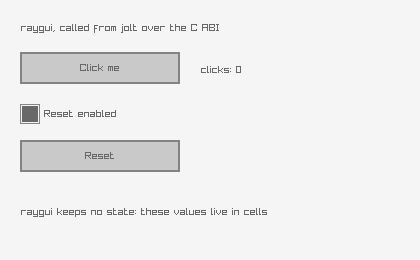</a><br><code>bb basic-controls</code><br><sub>button, label and a live click counter</sub></td>
<td width="33%" valign="top" align="center"><a href="docs/demos/icon-buttons.png">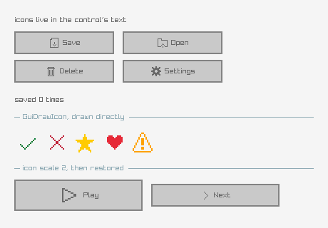</a><br><code>bb icon-buttons</code><br><sub>the embedded 1-bit icon pack on buttons</sub></td>
<td width="33%" valign="top" align="center"><a href="docs/demos/labels-lines.png">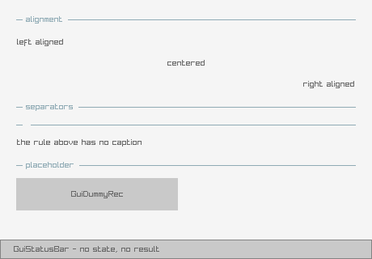</a><br><code>bb labels-lines</code><br><sub>labels, separators and a status bar</sub></td>
</tr>
<tr>
<td width="33%" valign="top" align="center"><a href="docs/demos/toggles.png">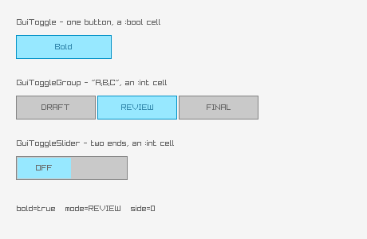</a><br><code>bb toggles</code><br><sub>toggle, toggle group and toggle slider</sub></td>
<td width="33%"></td>
<td width="33%"></td>
</tr>
</table>

#### inputs (5)

<table>
<tr>
<td width="33%" valign="top" align="center"><a href="docs/demos/text-box.png">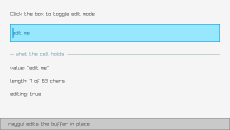</a><br><code>bb text-box</code><br><sub>an editable text box with edit mode</sub></td>
<td width="33%" valign="top" align="center"><a href="docs/demos/text-input-box.png">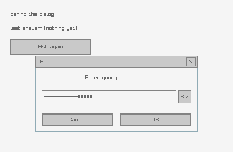</a><br><code>bb text-input-box</code><br><sub>a modal text prompt with secret toggle</sub></td>
<td width="33%" valign="top" align="center"><a href="docs/demos/spinner-value-box.png">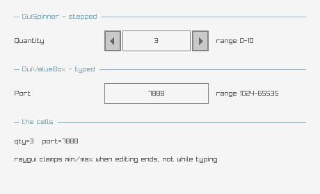</a><br><code>bb spinner-value-box</code><br><sub>spinner and value box, clamped and typed</sub></td>
</tr>
<tr>
<td width="33%" valign="top" align="center"><a href="docs/demos/sliders.png">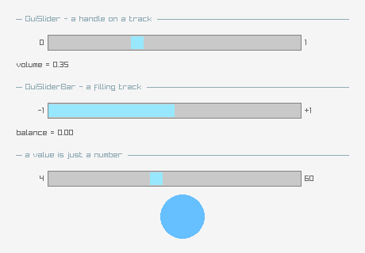</a><br><code>bb sliders</code><br><sub>slider, slider bar and their value cells</sub></td>
<td width="33%" valign="top" align="center"><a href="docs/demos/progress-bar.png">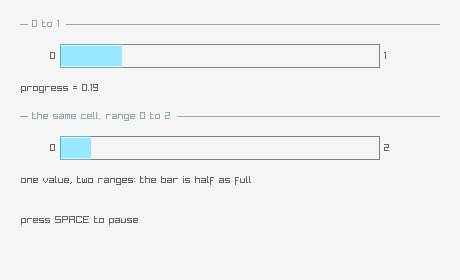</a><br><code>bb progress-bar</code><br><sub>a progress bar driven by a timer</sub></td>
<td width="33%"></td>
</tr>
</table>

#### collections (5)

<table>
<tr>
<td width="33%" valign="top" align="center"><a href="docs/demos/dropdown-box.png">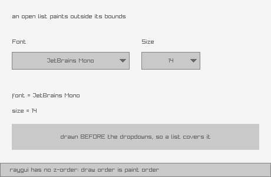</a><br><code>bb dropdown-box</code><br><sub>a dropdown that owns its edit mode</sub></td>
<td width="33%" valign="top" align="center"><a href="docs/demos/combo-box.png">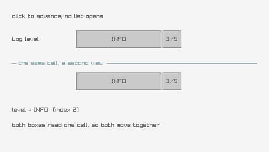</a><br><code>bb combo-box</code><br><sub>a combo box cycling through options</sub></td>
<td width="33%" valign="top" align="center"><a href="docs/demos/list-view.png">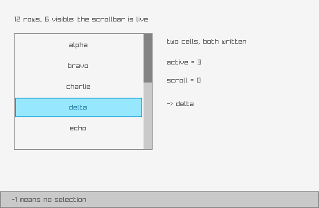</a><br><code>bb list-view</code><br><sub>a scrollable list with an active row</sub></td>
</tr>
<tr>
<td width="33%" valign="top" align="center"><a href="docs/demos/list-view-ex.png">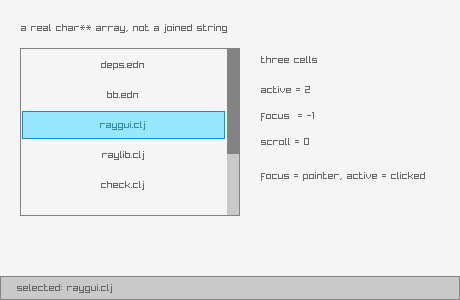</a><br><code>bb list-view-ex</code><br><sub>a list view reporting focus and scroll</sub></td>
<td width="33%" valign="top" align="center"><a href="docs/demos/tab-bar.png">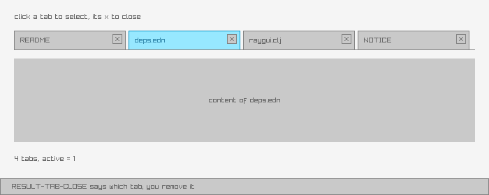</a><br><code>bb tab-bar</code><br><sub>tabs with close requests</sub></td>
<td width="33%"></td>
</tr>
</table>

#### containers (4)

<table>
<tr>
<td width="33%" valign="top" align="center"><a href="docs/demos/panel-group-box.png">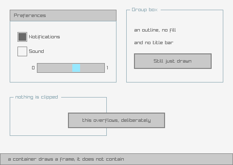</a><br><code>bb panel-group-box</code><br><sub>panels and group boxes as containers</sub></td>
<td width="33%" valign="top" align="center"><a href="docs/demos/scroll-panel.png">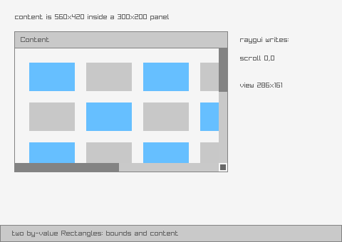</a><br><code>bb scroll-panel</code><br><sub>a scroll panel over oversized content</sub></td>
<td width="33%" valign="top" align="center"><a href="docs/demos/window-box.png">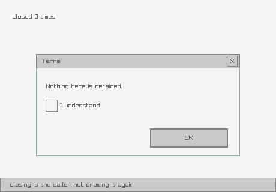</a><br><code>bb window-box</code><br><sub>a window box you can close and reopen</sub></td>
</tr>
<tr>
<td width="33%" valign="top" align="center"><a href="docs/demos/floating-window.png">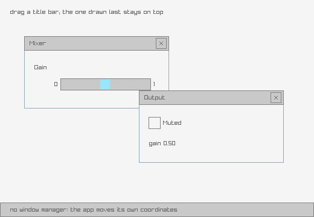</a><br><code>bb floating-window</code><br><sub>two draggable floating windows</sub></td>
<td width="33%"></td>
<td width="33%"></td>
</tr>
</table>

#### dialogs (2)

<table>
<tr>
<td width="33%" valign="top" align="center"><a href="docs/demos/message-box.png">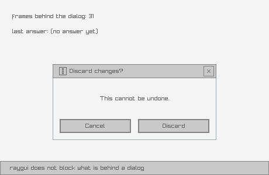</a><br><code>bb message-box</code><br><sub>a modal message box with two buttons</sub></td>
<td width="33%" valign="top" align="center"><a href="docs/demos/custom-input-box.png">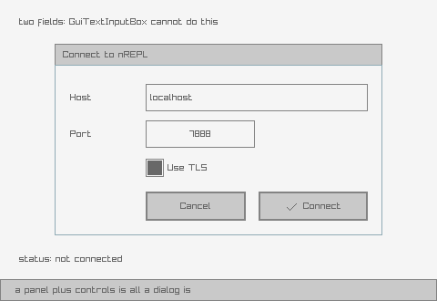</a><br><code>bb custom-input-box</code><br><sub>a hand-built input dialog over a panel</sub></td>
<td width="33%"></td>
</tr>
</table>

#### color (2)

<table>
<tr>
<td width="33%" valign="top" align="center"><a href="docs/demos/color-picker.png">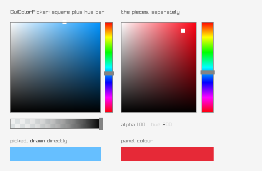</a><br><code>bb color-picker</code><br><sub>an RGB picker with an alpha bar</sub></td>
<td width="33%" valign="top" align="center"><a href="docs/demos/color-picker-hsv.png">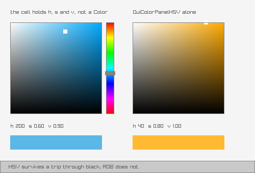</a><br><code>bb color-picker-hsv</code><br><sub>the HSV picker and panel</sub></td>
<td width="33%"></td>
</tr>
</table>

#### styling (2)

<table>
<tr>
<td width="33%" valign="top" align="center"><a href="docs/demos/style-selector.png">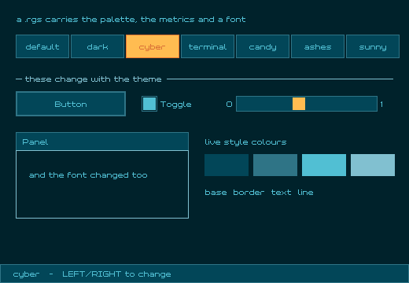</a><br><code>bb style-selector</code><br><sub>cycle six vendored .rgs style themes</sub></td>
<td width="33%" valign="top" align="center"><a href="docs/demos/gui-state.png">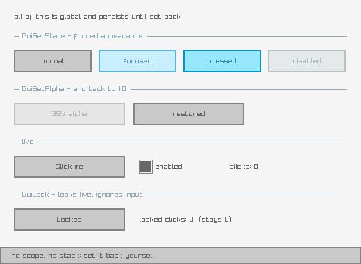</a><br><code>bb gui-state</code><br><sub>forced states, alpha and lock</sub></td>
<td width="33%"></td>
</tr>
</table>

<!-- END:examples -->

## How it works

raygui's API is 61 functions, and nearly all of them share one shape: a bounding
`Rectangle` passed **by value**, application state passed through a **pointer**,
and an **`int`** result telling the caller what happened. That one recurring
signature is what makes a small, direct FFI binding practical here, with no
callback machinery and no retained widget tree to model. See
[`docs/guide/the-ffi-shape.md`](docs/guide/the-ffi-shape.md) for the full account,
including the scratch-buffer trick that keeps every control from allocating inside
a frame.

## Verifying without a display

Every example honors two environment variables so it can prove itself with nobody
watching:

```sh
RAYGUI_APP_AUTO_QUIT_MS=1500 jolt -M:basic-controls   # close the window after 1.5s
RAYGUI_APP_SHOT=proof.png    jolt -M:basic-controls   # dump one frame as a PNG
```

The shot path must be **relative**: raylib prepends the working directory to it,
so an absolute path writes nothing. The helper verifies the file appeared and
prints `SHOT FAILED` rather than reporting a success it did not have.

**The PNG is the gate.** For a GUI toolkit, a headless compile check proves the code
loads, not that it renders correctly; several traps documented in the guide render a
plausible, wrong result rather than throwing. Looking at the screenshot is what
actually catches them.

## The AOT gate

`bb check` and every example run under `jolt run`, which cannot see a bug that
exists only in a built binary. jolt#757 was one of those: `jolt.ffi`'s own
`defn`s were interned but unbound in a `jolt build` image while `jolt run`
compiled them from source and worked. It is fixed now (jolt#756), and this repo
sits directly on the surface it broke, because `raygui.clj` calls
`ffi/layout-size` inside two top-level `def`s and `rect->` writes all four
Rectangle fields with `ffi/write-field`, which is the path every `Gui*` control
takes.

```sh
bb aot        # build basic-controls as a native binary, run it for 800ms
```

It builds a real example rather than the headless `check` entry point on
purpose. `check` only requires namespaces, so it would never call an accessor,
and it would pass while the binary was broken.

Two things it deliberately does not do. It runs from the repo root rather than a
temp directory, because `deps.edn` declares raygui at the repo-relative
`lib/libraygui.dylib`, which means a built binary is **not relocatable**: run it
anywhere else and it exits 255 with `required native library not found`. It is
also not part of `bb check` or CI, since it opens a real window and both of
those are headless.

## Documentation

- Guide: [`docs/guide/`](docs/guide/index.md), starting with
  [`index.md`](docs/guide/index.md).
- Site: <https://jlt-commons.github.io/raygui-jlt/>, the same content published and cross-linked.

## License and attribution

Released under the [Eclipse Public License 2.0](LICENSE), matching the rest of
jlt-commons and jolt itself. SPDX identifier: `EPL-2.0`. It was zlib until
2026-09-05, chosen to match raygui and raylib. Third-party attribution, including
the vendored raygui header and the ported examples, lives in [`NOTICE`](NOTICE);
`vendor/raygui.h` and the ported examples keep raygui's zlib terms, which EPL 2.0
does not and cannot change.
